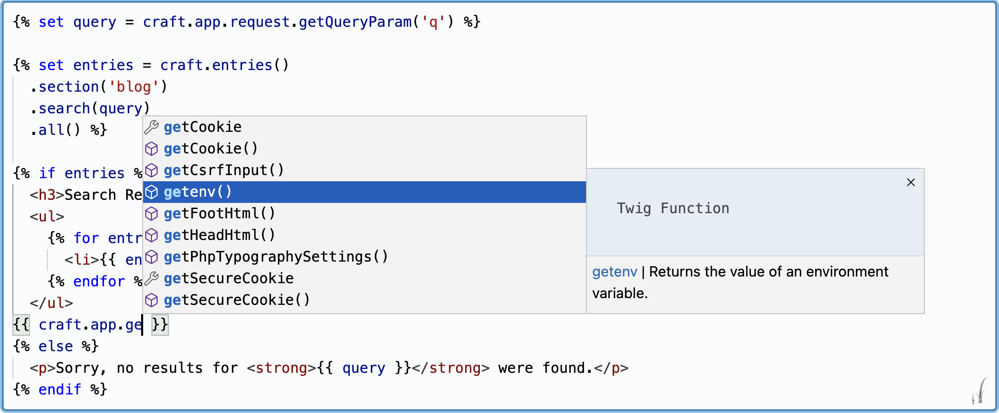
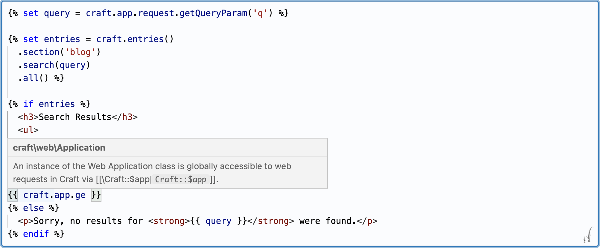

[](https://scrutinizer-ci.com/g/nystudio107/craft-twigfield/?branch=develop) [](https://scrutinizer-ci.com/g/nystudio107/craft-twigfield/?branch=develop) [](https://scrutinizer-ci.com/g/nystudio107/craft-twigfield/build-status/develop) [](https://scrutinizer-ci.com/code-intelligence)

# Twigfield for Craft CMS 3.x & 4.x

Provides a twig editor field with Twig & Craft API autocomplete


## Requirements

Twigfield requires Craft CMS 3.0 or 4.0.

## Installation

To install Twigfield, follow these steps:

1. Open your terminal and go to your Craft project:

        cd /path/to/project

2. Then tell Composer to require the package:

        composer require nystudio107/craft-twigfield

## About Twigfield

Twigfield provides a full-featured Twig editor with syntax highlighting via the powerful [Monaco Editor](https://microsoft.github.io/monaco-editor/) (the same editor that is the basis for VS Code).

Twigfield provides full autocompletion for [Twig](https://twig.symfony.com/doc/3.x/) filters/functions/tags, and the full [Craft CMS](https://craftcms.com/docs/4.x/) API, including installed plugins:



And it adds hover documentation when you hover the cursor over an expression:



You can also add your own custom Autocompletes, and customize the behavior of the editor.

Twigfield also provides a [Yii2 Validator](https://www.yiiframework.com/doc/guide/2.0/en/tutorial-core-validators) for Twig templates and object templates.

## Using Twigfield

Once you've added the `nystudio107/craft-twigfield` package to your plugin, module, or project, no further setup is needed. This is because it operates as an auto-bootstrapping Yii2 Module.

Twigfield is not a Craft CMS plugin, rather a package to be utilized by a plugin, module, or project.

It can be very easy to add to an existing project, as you can see from the [Preparse field pull request](https://github.com/besteadfast/craft-preparse-field/pull/81/files) that adds it the [Preparse plugin](https://github.com/besteadfast/craft-preparse-field).

### In the Craft CP

Twigfield works just like the Craft CMS `forms` macros that should be familiar to plugin and module developers.

#### Import Macros

Simply import the macros:

```twig

```

#### Multi-line Editor

Then to create a `textarea` multi-line editor, do the following:

```twig
{{ twigfield.textarea({
    id: 'myTwigfield',
    name: 'myTwigfield',
    value: textAreaText,
}) }}
```

...where `textAreaText` is a variable containing the initial text that should be in the editor field. This will create the Twig editor.

To create a `textareaField` multi-line editor, do the following:

```twig
{{ twigfield.textareaField({
    label: "Twig Editor"|t,
    instructions: "Enter any Twig code below, with full API autocompletion."|t,
    id: 'myTwigfield',
    name: 'myTwigfield',
    value: textAreaText,
}) }}
```

...where `textAreaText` is a variable containing the initial text that should be in the editor field. This will create the `label` and `instructions`, along with the Twig editor.

#### Single-line Editor

Then to create a `text` single-line editor, do the following:

```twig
{{ twigfield.text({
    id: 'myTwigfield',
    name: 'myTwigfield',
    value: text,
}) }}
```

...where `text` is a variable containing the initial text that should be in the editor field. This will create the Twig editor that is restricted to a single line, for simple Twig expressions.

To create a `textField` single-line editor, do the following:

```twig
{{ twigfield.textField({
    label: "Twig Editor"|t,
    instructions: "Enter any Twig code below, with full API autocompletion."|t,
    id: 'myTwigfield',
    name: 'myTwigfield',
    value: text,
}) }}
```

...where `text` is a variable containing the initial text that should be in the editor field. This will create the `label` and `instructions`, along with the Twig editor that is restricted to a single line, for simple Twig expressions.

Regardless of the macro used, an Asset Bundle containing the necessary CSS & JavaScript for the editor to function will be included, and the editor initialized.

### In Frontend Templates

By default, Twigfield will not work in frontend templates, unless you specifically enable it.

Do so by copying the `config.php` file to the Craft CMS `config/` directory, renaming the file to `twigfield.php` in the process, then set the `allowFrontendAccess` setting to `true`:

```php
return [
    // Whether to allow anonymous access be allowed to the twigfield/autocomplete/index endpoint
    'allowFrontendAccess' => true,
    // The default autcompletes to use for the default `Twigfield` field type
    'defaultTwigfieldAutocompletes' => [
        CraftApiAutocomplete::class,
        TwigLanguageAutocomplete::class,
    ]
];
```

Then import the macros:

```twig

```

Create your own `<textarea>` element and include the necessary JavaScript, passing in the `id` of your `textarea` element:

```html
<textarea id="myTwigfield">
</textarea>
{{ twigfield.includeJs("myTwigfield") }}
```

Enabling the `allowFrontendAccess` setting allows access to the `twigfield/autocomplete/index` endpoint, and add the `twigfield/templates` directory to the template roots.

### Additional Options

The `textarea`, `textareaField`, `text`, `textField`, and `includeJs` macros all take four additional optional parameters:

```twig
{{ textarea(config, fieldType, wrapperClass, editorOptions, twigfieldOptions) }}

{{ textareaField(config, fieldType, wrapperClass, editorOptions, twigfieldOptions }}

{{ text(config, fieldType, wrapperClass, editorOptions, twigfieldOptions) }}

{{ textField(config, fieldType, wrapperClass, editorOptions, twigfieldOptions }}

{{ includeJs(fieldId, fieldType, wrapperClass, editorOptions, twigfieldOptions }}
```

#### `fieldType`

**`fieldType`** - an optional 2nd parameter. By default this is set to `Twigfield`. You only need to change it to something else if you're using a custom Autocomplete (see below)

e.g.:

```twig
{{ twigfield.textarea({
    id: 'myTwigfield',
    name: 'myTwigfield',
    value: textAreaText,
}), "MyCustomFieldType" }}
```

#### `wrapperClass`

**`wrapperClass`** - an optional 3rd parameter. An additional class that is added to the Twigfield editor wrapper `div`. By default, this is an empty string.

e.g.:

```twig
{{ twigfield.textareaField({
    label: "Twig Editor"|t,
    instructions: "Enter any Twig code below, with full API autocompletion."|t,
    id: 'myTwigfield',
    name: 'myTwigfield',
    value: textAreaText,
}), "Twigfield", "monaco-editor-background-frame" }}
```

The `monaco-editor-background-frame` class is bundled, and will cause the field to look like a Craft CMS editor field, but you can use your own class as well.

There also a `monaco-editor-inline-frame` bundled style for an inline editor in a table cell (or elsewhere that no chrome is desired).

Both of these bundled styles use an accessibility focus ring when the editor is active, which mirrors the Craft CP style.

#### `editorOptions`

**`editorOptions`** - an optional 4th parameter. This is an [EditorOption](https://microsoft.github.io/monaco-editor/api/enums/monaco.editor.EditorOption.html) passed in to configure the Monaco editor. By default, this is an empty object.

e.g.:

```html
<textarea id="myTwigfield">
</textarea>
{{ twigfield.includeJs("myTwigfield", "Twigfield", "monaco-editor-background-frame", {
    lineNumbers: 'on',
}) }}
```

#### `twigfieldOptions`

**`twigfieldOptions`** - an optional 5th parameter.  This object that can contain any data you want to pass from your Twig template down to the Autocomplete. This can be leveraged in custom Autocompletes to pass contextual for a particular field to the Autocomplete (see below)

e.g.:

```twig
{{ twigfield.textareaField({
    label: "Twig Editor"|t,
    instructions: "Enter any Twig code below, with full API autocompletion."|t,
    id: 'myTwigfield',
    name: 'myTwigfield',
    value: textAreaText,
}), "Twigfield", "monaco-editor-background-frame", { lineNumbers: 'on' }, {
   'key': value,
   'key2': value2,
} }}
```

## Using Additional Autocompletes

By default, Twigfield uses the `CraftApiAutocomplete` & `TwigLanguageAutocomplete`, but it also includes an optional `EnvironmentVariableAutocomplete` which provides autocompletion of any Craft CMS [Environment Variables](https://craftcms.com/docs/4.x/config/#environmental-configuration) and [Aliases](https://craftcms.com/docs/4.x/config/#aliases).

If you want to use the `EnvironmentVariableAutocomplete` or a custom Autocomplete you write, you'll need to add a little PHP code to your plugin, module, or project:

```php
use nystudio107\twigfield\autocompletes\EnvironmentVariableAutocomplete;
use nystudio107\twigfield\events\RegisterTwigfieldAutocompletesEvent;
use nystudio107\twigfield\services\AutocompleteService;

Event::on(
    AutocompleteService::class,
    AutocompleteService::EVENT_REGISTER_TWIGFIELD_AUTOCOMPLETES,
    function (RegisterTwigfieldAutocompletesEvent $event) {
        $event->types[] = EnvironmentVariableAutocomplete::class;
    }
);
```

The above code will add Environment Variable & Alias autocompletes to all of your Twigfield editors.

However, because you might have several instances of a Twigfield on the same page, and they each may provide separate Autocompletes, you may want to selectively add a custom Autocomplete only when the `fieldType` matches a specific.

Here's an example from the [Sprig plugin](https://github.com/putyourlightson/craft-sprig):

```php
use nystudio107\twigfield\events\RegisterTwigfieldAutocompletesEvent;
use nystudio107\twigfield\services\AutocompleteService;
use putyourlightson\sprig\plugin\autocompletes\SprigApiAutocomplete;

public const SPRIG_TWIG_FIELD_TYPE = 'SprigField';

Event::on(
    AutocompleteService::class,
    AutocompleteService::EVENT_REGISTER_TWIGFIELD_AUTOCOMPLETES,
    function (RegisterTwigfieldAutocompletesEvent $event) {
        if ($event->fieldType === self::SPRIG_TWIG_FIELD_TYPE) {
            $event->types[] = SprigApiAutocomplete::class;
        }
    }
);
```

This ensures that the `SprigApiAutocomplete` Autocomplete will only be added when the `fieldType` passed into the Twigfield macros is set to `SprigField`.

Additionally, you may have an Autocomplete that you want to pass config information down to when it is instantiated. You can accomplish that by adding the Autocomplete as an array:

```php
use nystudio107\twigfield\autocompletes\CraftApiAutocomplete;
use nystudio107\twigfield\events\RegisterTwigfieldAutocompletesEvent;
use nystudio107\twigfield\services\AutocompleteService;

Event::on(
    AutocompleteService::class,
    AutocompleteService::EVENT_REGISTER_TWIGFIELD_AUTOCOMPLETES,
    function (RegisterTwigfieldAutocompletesEvent $event) {
         $config = [
             'additionalGlobals' => $arrayOfVariables,
         ];
        $event->types[] = [CraftApiAutocomplete::class => $config];
    }
);
```

Note that all of the above examples _add_ Autocompletes to the Autocompletes that Twigfield provides by default (`CraftApiAutocomplete` and `TwigLanguageAutocomplete`). If you want to _replace_ them entirely, just empty the `types[]` array first:

```php
        $event->types[] = [];
        $event->types[] = [CraftApiAutocomplete::class => $config];
```

## Writing a Custom Autocomplete

Autocompletes extend from the base [Autocomplete](https://github.com/nystudio107/craft-twigfield/blob/develop/src/base/Autocomplete.php) class, and implement the [AutocompleteInterface](https://github.com/nystudio107/craft-twigfield/blob/develop/src/base/AutocompleteInterface.php)

A simple Autocomplete would look like this:

```php
<?php
namespace myvendor\myname\autocompletes;

use nystudio107\twigfield\base\Autocomplete;
use nystudio107\twigfield\models\CompleteItem;
use nystudio107\twigfield\types\AutocompleteTypes;
use nystudio107\twigfield\types\CompleteItemKind;

class MyCustomAutocomplete extends Autocomplete
{
    public $name = 'EnvironmentVariableAutocomplete';

    public $type = AutocompleteTypes::GeneralAutocomplete;
    
    public $hasSubProperties = false;

    public function generateCompleteItems(): void
    {
    CompleteItem::create()
        ->label('MyAutocomplete')
        ->insertText('MyAutocomplete')
        ->detail('This is my autocomplete')
        ->documentation('This detailed documentation of my autocomplete')
        ->kind(CompleteItemKind::ConstantKind)
        ->add($this);
    }
}
```

The `$name` property is the name of your Autocomplete, and it is used for the autocomplete cache.

The `$type` property is either `AutocompleteTypes::TwigExpressionAutocomplete` (which only autocompletes inside of a Twig expression) or `AutocompleteTypes::GeneralAutocomplete` (which autocompletes everywhere).

The `$hasSubProperties` property indicates whether your Autocomplete returns nested sub-properties such as `foo.bar.baz`. This hint helps Twigfield present a better autocomplete experience.

`CompleteItem::create()` is a factory method that creates a `CompleteItem` object. You can use the Fluent Model setters as shown above, or you can set properties directly on the model as well. The `CompleteItem::add()` method adds it to the list of generated Autocompletes.

Your Autocomplete also has a `$twigfieldOptions` property which will contain any data passed down via the optional 5th `twigfieldOptions` parameter from your Twig template. This allows you to have contextual information this a particular field.

See the following examples for custom Autocompletes that you can use as a guide when creating your own:

* [TrackingVarsAutocomplete](https://github.com/nystudio107/craft-seomatic/blob/develop/src/autocompletes/TrackingVarsAutocomplete.php)
* [SprigApiAutocomplete](https://github.com/putyourlightson/craft-sprig/blob/develop/src/autocompletes/SprigApiAutocomplete.php)
* [CraftApiAutocomplete](https://github.com/nystudio107/craft-twigfield/blob/develop/src/autocompletes/CraftApiAutocomplete.php)
* [EnvironmentVariableAutocomplete](https://github.com/nystudio107/craft-twigfield/blob/develop/src/autocompletes/EnvironmentVariableAutocomplete.php)
* [TwigLanguageAutocomplete](https://github.com/nystudio107/craft-twigfield/blob/develop/src/autocompletes/TwigLanguageAutocomplete.php)

## Twig Template Validators

Twigfield also includes two Twig template [Validators](https://www.yiiframework.com/doc/guide/2.0/en/tutorial-core-validators) that you can use to validate Twig templates that are saved as part of a model:

* [TwigTemplateValidator](https://github.com/nystudio107/craft-twigfield/blob/develop/src/validators/TwigTemplateValidator.php) - validates the template via `renderString()`
* [TwigObjectTemplateValidator](https://github.com/nystudio107/craft-twigfield/blob/develop/src/validators/TwigObjectTemplateValidator.php) - validates the template via `renderObjectTemplate()`

You just add them as a rule on your model, and it will propagate the model with any errors that were encountered when rendering the template:

```php
use nystudio107\twigfield\validators\TwigTemplateValidator;

public function defineRules()
{
    return [
        ['myTwigCode', TwigTemplateValidator::class],
    ];
}
```

You can also add in any `variables` that should be presents in the Twig environment:

```php
use nystudio107\twigfield\validators\TwigTemplateValidator;

public function defineRules()
{
    return [
        [
            'myTwigCode', TwigTemplateValidator::class,
            'variables' => [
               'foo' => 'bar',
           ]
        ],
    ];
}
```

For the `TwigObjectTemplateValidator`, you can also pass in the `object` that should be used when rendering the object template:

```php
use nystudio107\twigfield\validators\TwigObjectTemplateValidator;

public function defineRules()
{
    return [
        [
            'myTwigCode', TwigObjectTemplateValidator::class, 
            'object' => $object,
            'variables' => [
               'foo' => 'bar',
           ]
        ],
    ];
}
```

## Twigfield Roadmap

Some things to do, and ideas for potential features:

* Perhaps a general code editor as an offshoot?
* Add a handler for parsing method return parameters, so we can get autocomplete on things like `craft.app.getSecurity().`
* Figure out why the suggestions details sub-window doesn't appear to size itself properly to fit the `documentation`. It's there, but you have to resize the window to see it, and it appears to be calculated incorrectly somehow
* Smarter Twig expression detection
* Hovers for `TwigExpressionAutocomplete`s should only be added if they are inside of a Twig expression
* It would be nice if `SectionShorthandFieldsAutocomplete` completions presented sub-item completions, too

Brought to you by [nystudio107](https://nystudio107.com/)
